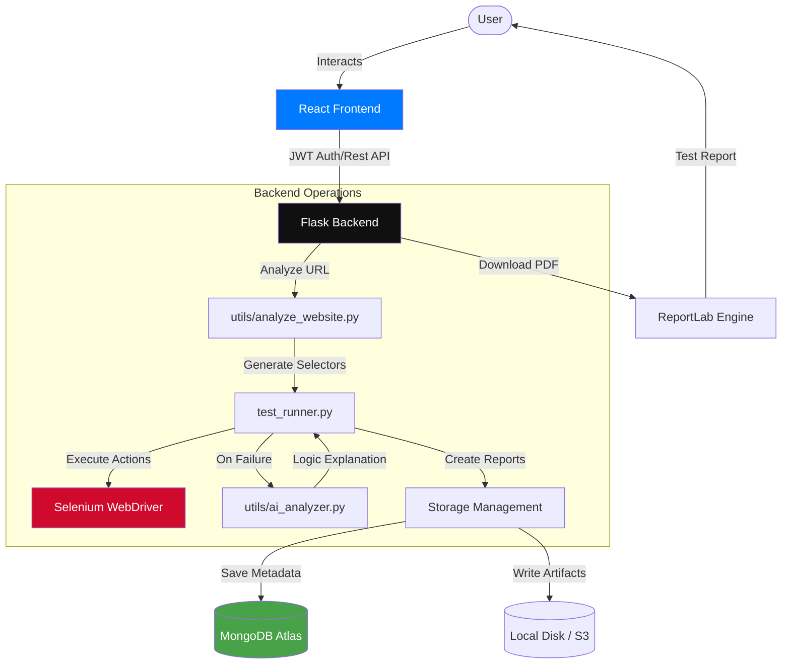

# 🎨 Project Walkthrough & Architecture Diagram

## 📊 System Flow Diagram

---

## 🏗️ 1. Project Architecture

The project is divided into two primary layers:

1.  **Frontend (React/Vite)**: A modern, responsive UI built with React 18 and Bootstrap. It handles user interactions, data visualization, and authentication state.
2.  **Backend (Flask/Python)**: A RESTful API following the Application Factory pattern. It handles the "heavy lifting"—from parsing websites to executing Selenium automations and coordinating with AI.

---

## ⚡ 2. Core Operational Logic

### A. Intelligent Website Analysis (`utils/analyze_website.py`)
- **Input**: A website URL.
- **Process**:
    1. Fetches HTML content using `requests`.
    2. Uses `BeautifulSoup` to scan for interactive elements (buttons, `<a>` tags, `<input>` fields).
    3. **Strategy**: Automatically generates robust CSS selectors (prioritizing `id`, then class names, then tag names).
- **Result**: A structured list of test recommendations (e.g., "Click this button", "Fill this email field").

### B. Automated Test Runner (`test_runner.py`)
- **Input**: URL and the recommendations generated in Step A.
- **Action**: 
    1. Spins up a headless Chrome instance via `Selenium`.
    2. Iterates through each recommendation, locating elements and performing actions (click/type).
    3. **AI Failure Analysis**: If a step fails, the `ai_analyzer.py` is invoked to provide a human-readable explanation of *why* the element was missing or unreachable.
- **Output**: Detailed results for each step stored in a JSON report.

---

## 🔄 3. Key User Flows

### 1️⃣ Authentication Flow
1. **Interaction**: User fills out the login or registration form.
2. **Logic**: Frontend sends credentials to `/api/register` or `/api/login`. 
3. **Security**: Passwords are saved as hashes (BCrypt/Werkzeug). Backend issues a **JWT (JSON Web Token)**.
4. **State**: The frontend context (`AuthContext`) stores this token, enabling access to protected routes like the Dashboard.

### 2️⃣ Automated Testing Flow (The "Happy Path")
1. **Input**: User enters a URL (e.g., `https://example.com`) and clicks **Analyze**.
2. **Backend**: `/api/analyze` triggers the analysis logic. Results (selectors + actions) are saved in MongoDB and shown on the UI.
3. **Execution**: User reviews recommendations and clicks **Run Tests**.
4. **Backend**: `/api/run_tests/<id>` executes Selenium. It updates the test run status from `PENDING` to `COMPLETED` once done.
5. **Report**: User views the result summary (Pass/Fail count) and can download a PDF version generated via `ReportLab`.

### 3️⃣ File & Asset Management Flow
1. **Upload**: User uploads a file (up to 50MB) via `/api/upload`.
2. **Storage**: 
    - **Physical**: Files are saved in `storage/uploads/` on the server disk.
    - **Metadata**: Filename, size, and timestamp are indexed in the `files` collection in MongoDB for instant retrieval.
3. **Usage**: Screenshots taken during failed tests are similarly managed in `storage/screenshots/`.

---

## 🗄️ 4. Data Layer (MongoDB Schema)

- **`users`**: Email and hashed passwords.
- **`test_runs`**: Tracks URL, owner, status, and link to the JSON report.
- **`test_recommendations`**: Stores the AI-determined sequences for a specific test run.
- **`manual_tests`**: User-defined test cases for manual QA teams.
- **`files`**: Metadata for all system assets (uploads/reports/screenshots).

---

## 🚀 5. Deployment Options
- **Local**: `python run.py` (Backend) + `npm run dev` (Frontend).
- **Containerized**: `docker-compose up --build` spins up both services + a development environment.
